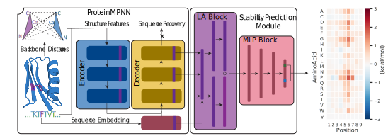

# ThermoMPNN
ThermoMPNN is a graph neural network (GNN) trained using transfer learning to predict changes in stability for protein point mutants.



For details on ThermoMPNN training and methodology, please see the accompanying [paper](https://doi.org/10.1073/pnas.2314853121). 

## Citing this work
If you use the code, please cite:
```
@article{
doi:10.1073/pnas.2314853121,
author = {Henry Dieckhaus  and Michael Brocidiacono  and Nicholas Z. Randolph  and Brian Kuhlman },
title = {Transfer learning to leverage larger datasets for improved prediction of protein stability changes},
journal = {Proceedings of the National Academy of Sciences},
volume = {121},
number = {6},
pages = {e2314853121},
year = {2024},
doi = {10.1073/pnas.2314853121},
URL = {https://www.pnas.org/doi/abs/10.1073/pnas.2314853121},
eprint = {https://www.pnas.org/doi/pdf/10.1073/pnas.2314853121},
}
```

## Colab Implementation
For a user-friendly version of ThermoMPNN requiring no installation, use this [Colab notebook](https://colab.research.google.com/drive/1OcT4eYwzxUFNlHNPk9_5uvxGNMVg3CFA#scrollTo=i06A5VI142NT).

## Installation
To install ThermoMPNN, first clone this repository
```
git clone https://github.com/Kuhlman-Lab/ThermoMPNN.git
```
Then use the file ```environment.yaml``` install the necessary python dependencies (I recommend using mamba for convenience):
```
mamba env create -f environment.yaml
```
This will create a conda environment called ```thermoMPNN```.

NOTE: installing from the .yaml file may cause pytorch to install incorrectly (CPU version instead of GPU version).

Alternate installation instructions:
```
# create and activate environment
mamba create -n thermoMPNN python=3.10
mamba activate thermoMPNN

# install pytorch related packages
mamba install pytorch torchvision torchaudio pytorch-cuda=11.8 pytorch-lightning -c nvidia -c pytorch -c conda-forge

# install all other packages
mamba install joblib omegaconf pandas numpy tqdm mmseqs2 wandb biopython -c bioconda -c conda-forge -c anaconda

# check for proper GPU recognition (should return True)
python -c 'import torch; print(torch.cuda.is_available())'
```

## Inference
There are a few different ways to run inference with ThermoMPNN all located in the ```analysis``` directory.

### From a PDB
The simplest way is to use the ```custom_inference.py``` script to pass a custom PDB to ThermoMPNN for site-saturation mutagenesis.

### From a CSV and many PDBs
For larger batches of predictions, it is recommended to set up a **CustomDataset** object by inheriting from the **ddgBenchDataset** class in the ```datasets.py``` file, then add this dataset to the ```SSM.py``` script to get aggregated predictions for the whole dataset.

### For benchmarking purposes
The ```thermompnn_benchmarking.py``` is set up to score different models on a **CustomDataset** object or one of the datasets used in this study. An example inference SLURM script is provided at ```examples/inference.sh```.

## Training
The main training script is ```train_thermompnn.py```. To set up a training run, you must write a ```config.yaml``` file (example provided) to specify model hyperparameters. You also must provide a ```local.yaml``` file to tell ThermoMPNN where to find your data. These files serve as experiment logs as well.

Training ThermoMPNN requires the use of a GPU. On a small dataset (<5000 data points), training takes <30s per epoch, while on a mega-scale dataset (>200,000 data points), it takes 8-12min per epoch (on a single V100 GPU). An example training SLURM script is provided at ```examples/train.sh```.

### Splits and Model Weights
For the purpose of replication and future benchmarking, the dataset splits used in this study are included as ```.pkl``` files under the ```dataset_splits/``` directory.

ThermoMPNN model weights can be found in the ```models/``` directory. The following model weights are provided:
```
- thermoMPNN_default.pt (best ThermoMPNN model trained on Megascale training dataset)
```

### Dataset Availability
The datasets used in this study can be found in the following locations:

Fireprot: https://doi.org/10.5281/zenodo.8169288
Megascale: https://doi.org/10.5281/zenodo.7401274
S669: https://doi.org/10.1093/bib/bbab555
SSYM, P53, Myoglobin, etc: https://protddg-bench.github.io
